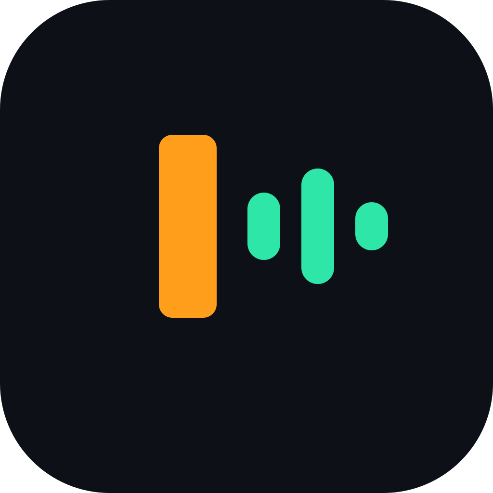

<p align="center">
  
</p>

<h1 align="center">Dilo</h1>

<h3 align="center">Dictado en español para Mac, rápido y sin que nada salga de tu compu</h3>

<p align="center">
  
  
  
  
</p>

Aprieta, habla, suelta. Aparece escrito donde tengas el cursor.

Dilo también existe como app multiplataforma en Tauri
(`/Volumes/SSD 1/Dilo/app`), **congelada en 0.3.2**. Esta es la versión nativa
de Mac, que continúa la numeración desde 0.4.0.

## Privacidad

Todo pasa en tu compu: `SpeechAnalyzer`/`SpeechTranscriber` de Apple para
reconocer, `AVSpeechSynthesizer` para leer en voz alta, `Translation` para
traducir y `FoundationModels` para transformar. Ese último es un modelo de
lenguaje, es de Apple, y corre acá: no hay key, no hay cuenta, no hay request.
Dilo no guarda audio y no manda nada a ningún lado.

Dos advertencias honestas:

- El texto dictado se **pega**, así que pasa por el portapapeles del sistema
  por medio segundo antes de que Dilo devuelva lo que tenías copiado. Un
  gestor de portapapeles o el Portapapeles Universal pueden verlo en esa
  ventana.
- Los **modos con proveedor en línea** (OpenAI, Gemini, Anthropic) mandan el
  texto ya transcrito a ese tercero. La tarjeta lo dice: **LOCAL** o **EN
  LÍNEA**, siempre. El dictado normal nunca sale de acá.

## Qué necesitas

- macOS 26 (Tahoe) o superior, en Apple Silicon. No hay binario Intel: para
  eso está el Tauri 0.3.2, congelado.

## Compilar

DerivedData va al disco de taller, nunca al interno:

```bash
git clone <este repo> && cd mac
open Dilo.xcodeproj                           # ⌘R

# o sin abrir Xcode
xcodebuild -project Dilo.xcodeproj -scheme Dilo -configuration Debug \
  -derivedDataPath /Volumes/SSD2/derived-data build

# el paquete propio
cd DiloCore && swift test
```

Hay **dos targets** desde el primer día:

| Target | Bundle | Para qué |
| --- | --- | --- |
| `Dilo` | `cl.espaciodigital.dilo` | venta directa, con updater (Sparkle) |
| `Dilo-MAS` | `cl.espaciodigital.dilo.mas` | App Sandbox, sin Sparkle, para App Store |

El sandbox no rompe la compilación: lo que se cae, se cae en ejecución. Por eso
el target MAS se prueba con `open -a Dilo-MAS.app` y **nunca** lanzando el
binario desde el terminal — TCC le atribuye los permisos al proceso padre y el
audio llega en silencio.

## Cómo se usa

| Qué quieres | Cómo |
| --- | --- |
| Dictar | Mantén **fn**, habla, suelta |
| Dictar sin sostener | Toque corto a **fn**, habla, otro toque para terminar |
| Cancelar a media frase | **Esc** |
| Transcribir un archivo | Arrastra el audio o el video al notch y suéltalo |
| Leer en voz alta lo seleccionado | **⌥ ⎋** |
| Todo lo demás | El fantasma de la barra de menús → Ajustes |

Los gatillos se reconfiguran en **Ajustes → Atajos**. Regla de la casa:
**ningún gatillo por defecto escribe símbolos** en teclado latino. Nada de ⌥
derecha sola — en ISO-LatAm es AltGr y escribe `@ # \ | { } [ ]`. El segundo
idioma viene apagado.

Dilo **nunca toca el volumen maestro**. Si algún día se silencia la música al
dictar, se pausa la reproducción.

## Arquitectura

La app vive en `Dilo/`, por feature:

- `Dilo/App/` — raíz de composición, ajustes persistidos, status item
- `Dilo/Input/` — el tap global de teclado y los atajos grabados
- `Dilo/Dictation/` — la máquina de sesión (un reducer puro con tests), los
  servicios de voz e inserción, y el HUD que sólo el dictado dibuja
- `Dilo/CoreHUD/` — lo que comparten todas las features: el panel único, la
  geometría y los shaders de Metal
- `Dilo/DropTranscription/`, `Translation/`, `ReadAloud/`, `Settings/`,
  `Insights/`, `Updates/`

Y todo lo de Dilo vive aparte, en un Swift Package local:

- `DiloCore/Sources/DiloText/` — español: muletillas, tus palabras
- `DiloCore/Sources/DiloEngines/` — el contrato `SpeechEngine` y sus motores
- `DiloCore/Sources/DiloModes/` — modos, proveedores y el `Decider`
- `DiloCore/Sources/DiloCapabilities/` — `HostCapabilities` completa y sandbox
- `DiloCore/Sources/DiloMetrics/` — los números del spec, medidos

`CONTEXT.md` es el modelo de dominio, `AGENTS.md` es el contrato de trabajo, la
dirección está en `docs/superpowers/specs/` y las decisiones heredadas en
`docs/adr/`.

## Licencia

[MIT](LICENSE). Los copyright de quienes escribieron el código que Dilo lleva
adentro se conservan intactos junto al propio, y la app los nombra en
**Ajustes → Acerca de → Licencias de terceros**.

## Agradecimientos

Dilo lleva trabajo de otros adentro, publicado con licencia abierta:

- **[Talkify](https://github.com/tornikegomareli/Talkify)**, de Tornike
  Gomareli (MIT) — el HUD del notch, la máquina de sesión del dictado y el tap
  global de teclado salieron de ahí, y están bien hechos.
- **[Handy](https://github.com/cjpais/Handy)**, de CJ Pais (MIT) — demostró
  que un dictado local, abierto y sin cuenta podía ser mejor que uno de pago.
  De ahí vienen los specs de producto que esta app reescribió en Swift.
- **[FluidAudio](https://github.com/FluidInference/FluidAudio)** (Apache 2.0)
  y **[Sparkle](https://github.com/sparkle-project/Sparkle)** (MIT), las dos
  dependencias.

Cómo llegó cada cosa acá está en [`docs/historia/`](docs/historia/README.md).
